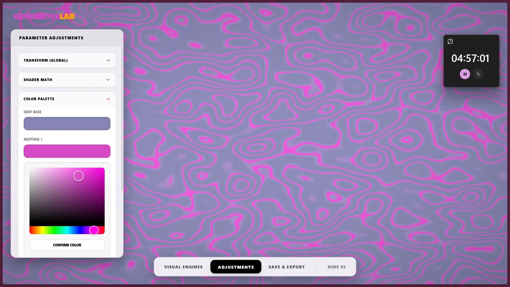

# GENERATIVE LAB



Aplicación moderna con React + Vite para visuales 3D en tiempo real usando three.js y @react-three/fiber.

Resumen

- Renderiza shaders en GPU y motores de partículas/mallas en un canvas WebGL.
- Construido con React, Vite, three.js, @react-three/fiber y @react-three/drei.

Características

- Núcleo de render modular y motores (malla, líneas, partículas).
- Varios shaders GLSL para efectos de superficie y partículas.
- Controles en vivo (barra lateral) para ajustar parámetros y presets.

Requisitos

- Node.js 16+ y npm
- Navegador moderno (Chrome, Firefox, Edge)

Inicio rápido

1. Instala dependencias:

```bash
npm install
```

2. Inicia el servidor de desarrollo:

```bash
npm run dev
```

3. Abre la aplicación en el navegador en la URL que muestre Vite (normalmente `http://localhost:5173`).

Construir y previsualizar

```bash
npm run build
npm run preview
```

Estructura del proyecto

- `src/` — código fuente
  - `components/` — componentes React y motores de render
  - `hooks/` — cargador de shaders, puente de motores, hooks de control
  - `shaders/` — fuentes GLSL (superficie, partículas, líneas)

Uso de la página

- La vista principal es un canvas 3D. Usa el ratón para orbitar/zoom (si los controles están habilitados).
- La barra lateral permite cambiar shaders activos, ajustar `uniforms` (color, intensidad, velocidad) y activar sistemas de partículas.
- Prueba los presets y luego modifica parámetros para ver su efecto.

Resolución de problemas

- Si algo falla, revisa la consola del navegador para errores de compilación de shaders.
- Vuelve a ejecutar `npm install` si faltan módulos.
- Ejecuta `npm run lint` para mostrar advertencias de lint.

Despliegue

- SPA estática: despliega en Vercel, Netlify o cualquier hosting estático.
- En Vercel: conecta el repo; Vercel detecta proyectos Vite automáticamente.

Créditos y licencia

Usa librerías OSS como `three`, `@react-three/fiber` y `@react-three/drei`. Revisa `package.json` para versiones.

Contacto

Puedo añadir CI, una demo pública o configuraciones de despliegue si lo deseas.
